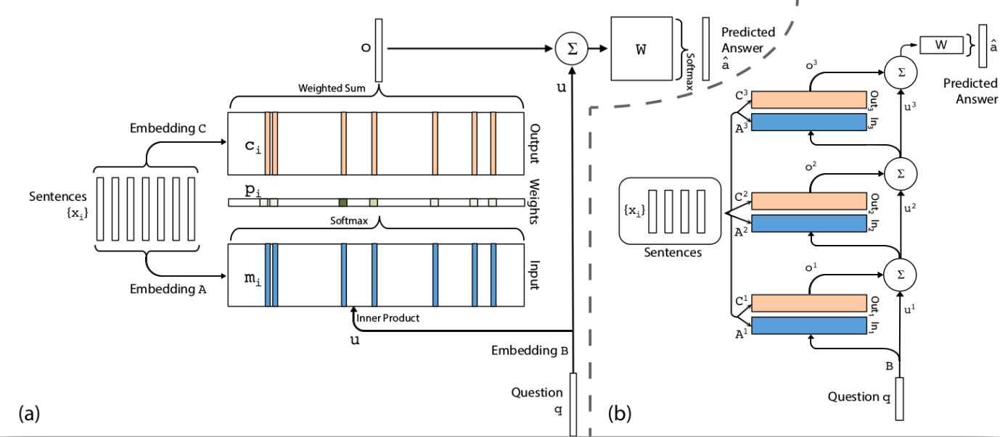
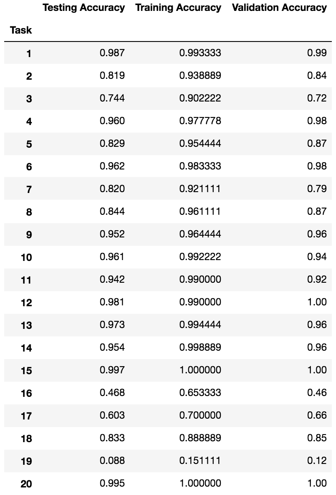

# End-To-End Memory Network
Implementation of a MemN2N model as proposed by [Sukhbaatar et al.](https://arxiv.org/pdf/1503.08895.pdf].), evaluated on 20 different question answering tasks for reasoning over text, from [Facebook's bAbi dataset](https://research.fb.com/downloads/babi/).

 <br />
 <br />

## Installation: ##
```
cd memN2N
sudo pip install virtualenv
virtualenv -p python3 .env
source .env/bin/activate
pip install -r requirements.txt
pip install -r requirements_tf.txt
jupyter notebook memory_networks_tf.ipynb

deactivate
```
